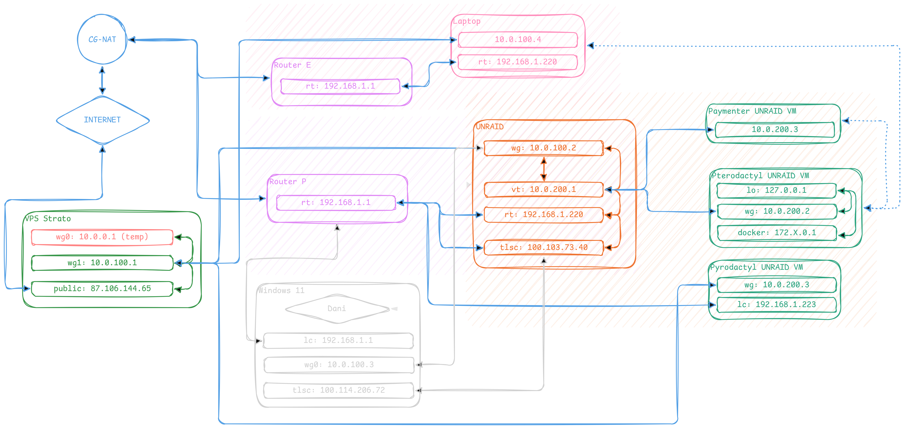

# 🌐 Global Network Infrastructure Documentation



## 📚 Table of Contents

- [🌐 Global Network Infrastructure Documentation](#-global-network-infrastructure-documentation)
  - [📚 Table of Contents](#-table-of-contents)
  - [🧠 Logical Architecture: "Hub-and-Spoke"](#-logical-architecture-hub-and-spoke)
  - [🚦 Traffic Flow \& Key Concepts](#-traffic-flow--key-concepts)
    - [1. iptables (The Linux Firewall)](#1-iptables-the-linux-firewall)
    - [2. The Packet Journey (Example: "Storm" Node)](#2-the-packet-journey-example-storm-node)
  - [☁️ Node 1: VPS Strato (The Gateway)](#️-node-1-vps-strato-the-gateway)
    - [1. Dynamic Firewall Engine (`rules.sh`)](#1-dynamic-firewall-engine-rulessh)
    - [2. WireGuard Configuration (`wg1.conf`)](#2-wireguard-configuration-wg1conf)
    - [3. Zone Definitions](#3-zone-definitions)
      - [A. Unraid VM (`ptero.conf`)](#a-unraid-vm-pteroconf)
      - [B. Dell Laptop "Storm" (`storm.conf`)](#b-dell-laptop-storm-stormconf)
    - [4. Reverse Proxy (`Caddyfile`)](#4-reverse-proxy-caddyfile)
  - [🏗️ Node 2: Unraid (The Core)](#️-node-2-unraid-the-core)
    - [1. WireGuard Configuration (`Wireguard Docker`)](#1-wireguard-configuration-wireguard-docker)
  - [💻 Node 3: Dell Laptop "Storm" (The Satellite)](#-node-3-dell-laptop-storm-the-satellite)


-----

## 🧠 Logical Architecture: "Hub-and-Spoke"

The infrastructure utilizes a centralized **Hub-and-Spoke** model.

  * **The Hub (Node 1):** The VPS acts as the central router, firewall, and reverse proxy. It is the only device with a Public IP exposed to the raw internet.
  * **The Core (Node 2):** Your Unraid server. It hosts the **Pterodactyl Panel** (the brain) and the primary **Wings** (game server instances). It sits behind the VPN on a virtualized bridge.
  * **The Satellite (Node 3):** The Dell Laptop ("Storm"). It connects directly to the VPN as a peer and acts as a secondary **Wings** node to offload processing power.

-----

## 🚦 Traffic Flow & Key Concepts

Before looking at the files, it is crucial to understand the Linux networking concepts used here.

### 1\. iptables (The Linux Firewall)

`iptables` is the tool used to route traffic. We use three specific tables/chains:

  * **NAT (Network Address Translation):**
      * **DNAT (Destination NAT):** "Forwarding." When a player hits the VPS on port 25565, DNAT changes the destination IP from the VPS to the internal VPN IP (e.g., `10.0.200.2`).
      * **SNAT / MASQUERADE (Source NAT):** "Impersonation." When the VPS forwards that packet, it changes the *Source IP* to its own VPN IP (`10.0.100.1`).
          * *Why?* If we didn't do this, the Game Server would see the player's real IP, try to reply directly via its local internet (Unraid's home ISP), and the player's computer would reject the packet because it didn't ask Unraid, it asked the VPS. **Masquerading ensures the reply goes back through the Tunnel.**
  * **FORWARD:**
      * By default, Linux blocks traffic moving *between* interfaces (e.g., from `eth0` to `wg1`). We must explicitly `ACCEPT` these packets.

### 2\. The Packet Journey (Example: "Storm" Node)

1.  **Player** connects to `storm.danicdn.tech:26000`.
2.  **VPS** receives packet on Public Interface.
3.  **`rules.sh`** applies DNAT: "Send this to `10.0.100.4`".
4.  **`rules.sh`** applies MASQUERADE: "Tell `10.0.100.4` that *I* (The VPS) sent this."
5.  **Dell Laptop** receives packet on `wg0` interface.
6.  **Docker** on Laptop processes request and replies to VPS.
7.  **VPS** sends reply back to Player.

-----

## ☁️ Node 1: VPS Strato (The Gateway)

**OS:** Ubuntu
**Role:** Public Entry Point, Router, Firewall.

### 1\. Dynamic Firewall Engine (`rules.sh`)

*Location: `/etc/wireguard/scripts/rules.sh`*

This script is the heart of the network. It automatically detects the public network interface and applies forwarding rules based on the `.conf` files located in the `zones/` directory.

**Changes:** Comments translated to English. Logic allows hot-reloading (`up`/`down`).

```bash
#!/bin/bash

# --- PARAMETERS ---
ACTION=$1                   # "up" or "down"
INTERFACE=$2                # "wg1"
ZONE_DIR="/etc/wireguard/zones/$INTERFACE"

# AUTOMATIC PUBLIC INTERFACE DETECTION
# This finds the card used to reach Google (8.8.8.8). Usually eth0 or ens6.
PUB_INT=$(ip route get 8.8.8.8 | awk -- '{print $5}')

# Validation
if [ -z "$INTERFACE" ]; then
    echo "❌ Error: Missing interface. Usage: $0 {up|down} wg1"
    exit 1
fi

if [ "$ACTION" == "up" ]; then
    echo "🚀 [VPS] Dynamic Firewall for $INTERFACE (Exit via: $PUB_INT)"

    # 1. PREPARATION
    # Enable Kernel IP Forwarding
    sysctl -w net.ipv4.ip_forward=1 > /dev/null

    # ⚠️ WE DO NOT FLUSH GLOBALLY (-F) TO AVOID BREAKING DOCKER
    # Instead, we trust 'down' to clean up old rules.

    # 2. MASQUERADE (So packets return correctly)
    # We only mask traffic LEAVING via the VPN interface
    iptables -t nat -A POSTROUTING -o $INTERFACE -j MASQUERADE

    # 3. PERMISSION RULES (FORWARD) - CRITICAL!
    # "Allow traffic from Internet to VPN"
    iptables -A FORWARD -i $PUB_INT -o $INTERFACE -j ACCEPT
    # "Allow traffic from VPN to Internet (Replies)"
    iptables -A FORWARD -i $INTERFACE -o $PUB_INT -j ACCEPT

    # 4. ZONE LOADING
    if [ -d "$ZONE_DIR" ]; then
        for CONFIG_FILE in "$ZONE_DIR"/*.conf; do
            [ -e "$CONFIG_FILE" ] || continue

            source "$CONFIG_FILE"
            echo "   📂 Zone: $(basename "$CONFIG_FILE") -> $IP_DEST"

            # --- TCP RULES ---
            if [ ! -z "$TCP_PORTS" ]; then
                for PORT in $TCP_PORTS; do
                    # Added "-i $PUB_INT" so it only affects external traffic
                    iptables -t nat -A PREROUTING -i $PUB_INT -p tcp --dport $PORT -j DNAT --to-destination $IP_DEST
                done
            fi

            # --- UDP RULES ---
            if [ ! -z "$UDP_PORTS" ]; then
                for PORT in $UDP_PORTS; do
                    iptables -t nat -A PREROUTING -i $PUB_INT -p udp --dport $PORT -j DNAT --to-destination $IP_DEST
                done
            fi
        done
    fi
    echo "✅ Rules applied successfully."

elif [ "$ACTION" == "down" ]; then
    echo "🛑 [VPS] Cleaning rules for $INTERFACE..."

    # We must be specific when deleting to not kill Docker networking
    
    # Remove Masquerade
    iptables -t nat -D POSTROUTING -o $INTERFACE -j MASQUERADE 2>/dev/null

    # Remove Forwarding
    iptables -D FORWARD -i $PUB_INT -o $INTERFACE -j ACCEPT 2>/dev/null
    iptables -D FORWARD -i $INTERFACE -o $PUB_INT -j ACCEPT 2>/dev/null

    # Remove DNAT 
    # (DNAT rules associated with the interface usually clear when the WG interface is destroyed)
    
    echo "✅ VPN rules removed (Residual NAT may require manual cleanup if not rebooting)."
fi
```

### 2\. WireGuard Configuration (`wg1.conf`)

*Location: `/etc/wireguard/wg1.conf`*

This configures the VPN interface `wg1`. Note the use of **Port 51821** to avoid conflicts with legacy configs.

```ini
[Interface]
# VPS IP inside the NEW exclusive Unraid/Laptop network
Address = 10.0.100.1/24

# IMPORTANT! Using port 51821 to not clash with wg0
ListenPort = 51821

# Server Private Key
PrivateKey = <PrivateKey_VPS>

# --- HOOKS ---
# When the interface starts, run the firewall script.
# %i is replaced automatically by "wg1"
PostUp = /etc/wireguard/scripts/rules.sh up %i
PostDown = /etc/wireguard/scripts/rules.sh down %i

# --- PEER: UNRAID (THE CORE) ---
[Peer]
PublicKey = <PublicKey_Unraid>
PresharedKey = <PresharedKey>
# Routes traffic for the Unraid Node AND its internal VM network (200.0/24)
AllowedIPs = 10.0.100.0/24, 10.0.200.0/24

# --- PEER: DELL LAPTOP (THE SATELLITE) ---
[Peer]
PublicKey = <PublicKey_Laptop>
PresharedKey = <PresharedKey>
# Routes traffic specifically to the Laptop
AllowedIPs = 10.0.100.4/32
```

### 3\. Zone Definitions

*Location: `/etc/wireguard/zones/wg1/`*

These files define where traffic goes. Adding a new server is as simple as creating a new file here and restarting `wg1`.

#### A. Unraid VM (`ptero.conf`)

Targets the Virtual Machine inside Unraid.

```bash
# Configuration for Main Pterodactyl Node
IP_DEST="10.0.200.2"

# TCP Ports (Ranges with colon, singles with space)
# 2022 is for SFTP
TCP_PORTS="25565:25999 2022"

# UDP Ports (Game Traffic)
UDP_PORTS="25565:25999"
```

#### B. Dell Laptop "Storm" (`storm.conf`)

Targets the physical Laptop connected via VPN.

```bash
# Configuration for Secondary Wings Node (Storm)
IP_DEST="10.0.100.4"

# TCP Ports
# Note the distinct range to avoid overlap with Main Node
TCP_PORTS="26000:26256 2022"

# UDP Ports
UDP_PORTS="26000:26256"
```

### 4\. Reverse Proxy (`Caddyfile`)

*Location: `~/caddy/conf/Caddyfile`*

Caddy handles domain names and SSL. It routes web traffic (HTTP/HTTPS) to the internal IPs.

```text
# --- UNRAID NODE (THE CORE) ---

# The Main Panel (Web Interface)
ptero.danicdn.tech {
    reverse_proxy 10.0.200.2:80
}

# The Main Wings Service (WebSocket for Console/Stats)
wings.danicdn.tech:8080 {
    reverse_proxy 10.0.200.2:8080
}

# Billing Panel (Paymenter - running on a sibling VM in Unraid)
billing.danicdn.tech {
    reverse_proxy 10.0.200.3:80
}

# --- DELL LAPTOP (THE SATELLITE) ---

# Secondary Wings Service
storm.danicdn.tech:8080 {
    reverse_proxy 10.0.100.4:8080
}

# --- LEGACY / OTHER NETWORKS ---
# Note: These point to 12.0.1.2, likely on the legacy wg0 interface.

pyro.danicdn.tech {
    reverse_proxy 12.0.1.2:80
}

daemon.danicdn.tech:8081 {
    reverse_proxy 12.0.1.2:8081
}

daemon.danicdn.tech {
    reverse_proxy 12.0.1.2:8081
}

# --- LOCALHOST SERVICES (Running on VPS) ---

theblockheads.me {
    reverse_proxy localhost:15151
}

join.theblockheads.me {
    reverse_proxy localhost:9924
}

status.danicdn.tech {
    reverse_proxy localhost:3001
}
```

-----

## 🏗️ Node 2: Unraid (The Core)

**Role:** Primary Compute Node
**VPN IP:** `10.0.100.2`
**Internal Network:** `10.0.200.x`

This node is special because it does not just run containers; it bridges a connection to a Virtual Machine (VM) that runs the Docker containers.

1.  **Incoming Traffic:** Arrives at Unraid via WireGuard (`10.0.100.2`).
2.  **Routing:** Unraid forwards this to the VM bridge (`virbr0` -\> `10.0.200.2`).
3.  **VM Handling:** The VM runs the **Pterodactyl Panel** and the **Main Wings** instance.
4.  **Fix Script:** A script inside the VM (`fix_ptero.sh`) is required to trick Docker into accepting forwarded traffic by rewriting it as `localhost` traffic.

### 1\. WireGuard Configuration (`Wireguard Docker`)

*Location: `/.../Wireguard-Docker/wg0.conf`*
```conf
[Interface]
Address = 10.0.100.2/24
PrivateKey = PrivateKey
ListenPort = 51821

# He quitado el "sysctl..." del principio. Solo IPTABLES.
PostUp = iptables -I FORWARD 1 -i %i -o virbr0 -j ACCEPT; iptables -I FORWARD 1 -i virbr0 -o %i -j ACCEPT; iptables -t nat -I POSTROUTING 1 -o virbr0 -j MASQU>

PostDown = iptables -D FORWARD -i %i -o virbr0 -j ACCEPT; iptables -D FORWARD -i virbr0 -o %i -j ACCEPT; iptables -t nat -D POSTROUTING -o virbr0 -j MASQUERAD>

# Strato
[Peer]
PublicKey = PublicKey
PresharedKey = PresharedKey
Endpoint = Endpoint:51821
AllowedIPs = 10.0.100.1/32
PersistentKeepalive = 25

# Windows 11
[Peer]
PublicKey = PublicKey
PresharedKey = PresharedKey
AllowedIPs = 10.0.100.3/32
```


-----

## 💻 Node 3: Dell Laptop "Storm" (The Satellite)

**Role:** Secondary Wings Node
**VPN IP:** `10.0.100.4`
**Hostname:** `storm.danicdn.tech`

This node is a "Satellite" used to expand capacity without touching the core server. It connects directly to the VPN mesh.

1.  **Simplicity:** Unlike Unraid, "Storm" does not use complex bridging. The WireGuard interface (`wg0` on the laptop) sits directly on the OS.
2.  **Wings Configuration:** The Wings `config.yml` on this laptop binds to `0.0.0.0`, but the Pterodactyl Panel (on Unraid) is configured to talk to it via the VPN IP `10.0.100.4`.
3.  **Port Range:** Dedicated range `26000-26256` ensures no overlap with the main server if they were ever merged, and keeps firewall rules clean.