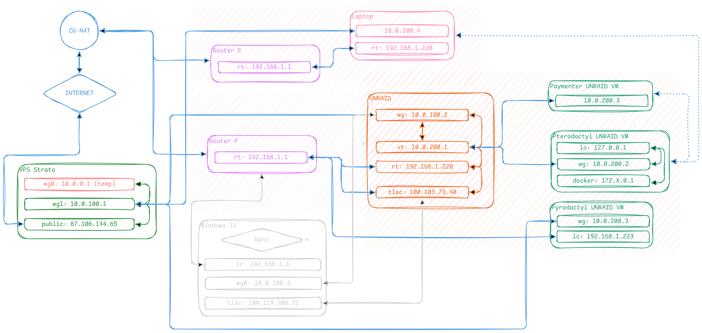

# 🌐 Global Network Infrastructure Documentation



## 📚 Table of Contents

- [🌐 Global Network Infrastructure Documentation](#-global-network-infrastructure-documentation)
  - [📚 Table of Contents](#-table-of-contents)
  - [🧠 Logical Architecture: "Hub-and-Spoke" & Zero Trust](#-logical-architecture-hub-and-spoke--zero-trust)
  - [🚦 Traffic Flow & Key Concepts](#-traffic-flow--key-concepts)
    - [1. iptables (The Linux Firewall)](#1-iptables-the-linux-firewall)
    - [2. The Packet Journey (Example: "Storm" Node)](#2-the-packet-journey-example-storm-node)
  - [☁️ Node 1: VPS Strato (The Gateway)](#️-node-1-vps-strato-the-gateway)
    - [1. Dynamic Firewall Engine (`rules.sh`)](#1-dynamic-firewall-engine-rulessh)
    - [2. WireGuard Configuration (`wg1.conf`)](#2-wireguard-configuration-wg1conf)
    - [3. Zone Definitions](#3-zone-definitions)
      - [A. Unraid VM (`ptero.conf`)](#a-unraid-vm-pteroconf)
      - [B. Dell Laptop "Storm" (`storm.conf`)](#b-dell-laptop-storm-stormconf)
    - [4. Reverse Proxy (`Caddyfile`)](#4-reverse-proxy-caddyfile)
  - [🏗️ Node 2: Unraid (The Core)](#️-node-2-unraid-the-core)
    - [1. WireGuard Configuration & Lateral Movement Protection](#1-wireguard-configuration--lateral-movement-protection)
  - [💻 Node 3: Dell Laptop "Storm" (The Satellite)](#-node-3-dell-laptop-storm-the-satellite)

---

## 🧠 Logical Architecture: "Hub-and-Spoke" & Zero Trust

The infrastructure utilizes a centralized **Hub-and-Spoke** model secured by a strict **Zero Trust** firewall policy.

  * **The Gateway (Node 1):** The VPS acts as the central router, strict firewall, and reverse proxy. It is the only device with a Public IP exposed to the raw internet. It drops all unapproved routing traffic by default.
  * **The Core (Node 2):** Your Unraid server. It hosts the **Pterodactyl Panel** and the primary **Wings** game servers. It sits behind the VPN on a virtualized bridge. It features internal isolation to prevent compromised game servers from accessing the home LAN.
  * **The Satellite (Node 3):** The Dell Laptop ("Storm"). It connects directly to the VPN as a peer and acts as a secondary **Wings** node to offload processing power.
  * **The Admin:** A designated management device (e.g., Windows PC) on the VPN that holds exclusive rights to access internal management interfaces.

---

## 🚦 Traffic Flow & Key Concepts

Before looking at the files, it is crucial to understand the Linux networking concepts used here.

### 1. iptables (The Linux Firewall)

`iptables` is the tool used to route and secure traffic. We use custom chains to avoid interfering with Docker:

  * **NAT (Network Address Translation):**
      * **DNAT (Destination NAT):** When a player hits the VPS on port 25565, DNAT changes the destination IP from the VPS to the internal VPN IP (e.g., `10.0.200.2`).
      * **SNAT / MASQUERADE (Source NAT):** When the VPS forwards that packet, it changes the *Source IP* to its own VPN IP (`10.0.100.1`). This ensures the game server's reply is routed back through the encrypted tunnel instead of its local ISP.
  * **FORWARD:**
      * The VPS acts as a strict bouncer. The `FORWARD` chain drops everything coming from the internet by default, only allowing connections to specific ports mapped in the zone configurations.

### 2. The Packet Journey (Example: "Storm" Node)

1.  **Player** connects to `storm.danicdn.tech:26000`.
2.  **VPS** receives the packet on its Public Interface.
3.  **`rules.sh`** applies DNAT: "Send this to `10.0.100.4`".
4.  **`rules.sh`** applies MASQUERADE: "Tell `10.0.100.4` that *I* (The VPS) sent this."
5.  **Dell Laptop** receives the packet on the `wg0` interface.
6.  **Docker** on Laptop processes the request and replies to the VPS.
7.  **VPS** sends the reply back to the Player.

---

## ☁️ Node 1: VPS Strato (The Gateway)

**OS:** Ubuntu
**Role:** Public Entry Point, Router, Zero-Trust Firewall.

### 1. Dynamic Firewall Engine (`rules.sh`)

*Location: `/etc/wireguard/scripts/rules.sh`*

This script is the heart of the network. It automatically detects the public network interface and applies strict forwarding rules based on `.conf` files in the `zones/` directory. It uses isolated Custom Chains (`WG1_FORWARD`, `WG1_PREROUTING`) to ensure clean application and removal without breaking Docker's own rules.

```bash
#!/bin/bash

# --- PARAMETERS ---
ACTION=$1                   # "up" or "down"
INTERFACE=$2                # "wg1"
ZONE_DIR="/etc/wireguard/zones/$INTERFACE"

# AUTOMATIC PUBLIC INTERFACE DETECTION
PUB_INT=$(ip route get 8.8.8.8 | awk -- '{print $5}')

if [ -z "$INTERFACE" ]; then
    echo "❌ Error: Missing interface. Usage: $0 {up|down} wg1"
    exit 1
fi

if [ "$ACTION" == "up" ]; then
    echo "🚀 [VPS] Dynamic Firewall for $INTERFACE (Exit via: $PUB_INT)"

    sysctl -w net.ipv4.ip_forward=1 > /dev/null

    # 1. MASQUERADE (So game traffic replies return correctly)
    iptables -t nat -A POSTROUTING -o $INTERFACE -j MASQUERADE

    # 2. CREATE CUSTOM CHAINS (To avoid touching Docker or system rules)
    iptables -N WG1_FORWARD
    iptables -t nat -N WG1_PREROUTING

    # Hook the chains to the top of the firewall
    iptables -I FORWARD 1 -j WG1_FORWARD
    iptables -t nat -I PREROUTING 1 -i $PUB_INT -j WG1_PREROUTING

    # 3. BASE SECURITY RULES
    # Allow traffic for already established connections
    iptables -A WG1_FORWARD -m state --state RELATED,ESTABLISHED -j ACCEPT

    # 4. LOAD ZONES (Dynamic port forwarding)
    if [ -d "$ZONE_DIR" ]; then
        for CONFIG_FILE in "$ZONE_DIR"/*.conf; do
            [ -e "$CONFIG_FILE" ] || continue
            source "$CONFIG_FILE"
            echo "   📂 Zone: $(basename "$CONFIG_FILE") -> $IP_DEST"

            # --- TCP ---
            if [ ! -z "$TCP_PORTS" ]; then
                for PORT in $TCP_PORTS; do
                    # DNAT
                    iptables -t nat -A WG1_PREROUTING -p tcp --dport $PORT -j DNAT --to-destination $IP_DEST
                    # ALLOW through FORWARD chain
                    iptables -A WG1_FORWARD -i $PUB_INT -o $INTERFACE -p tcp -d $IP_DEST --dport $PORT -j ACCEPT
                done
            fi

            # --- UDP ---
            if [ ! -z "$UDP_PORTS" ]; then
                for PORT in $UDP_PORTS; do
                    # DNAT
                    iptables -t nat -A WG1_PREROUTING -p udp --dport $PORT -j DNAT --to-destination $IP_DEST
                    # ALLOW through FORWARD chain
                    iptables -A WG1_FORWARD -i $PUB_INT -o $INTERFACE -p udp -d $IP_DEST --dport $PORT -j ACCEPT
                done
            fi
        done
    fi

    # 5. THE ZERO TRUST SHIELD (Final DROP)
    # Anything else trying to cross from the Internet into the VPN is dropped.
    iptables -A WG1_FORWARD -i $PUB_INT -o $INTERFACE -j DROP

    echo "✅ Rules and Chains applied successfully."

elif [ "$ACTION" == "down" ]; then
    echo "🛑 [VPS] Cleaning rules for $INTERFACE..."

    # Remove Masquerade
    iptables -t nat -D POSTROUTING -o $INTERFACE -j MASQUERADE 2>/dev/null

    # Unhook and delete FORWARD custom chain
    iptables -D FORWARD -j WG1_FORWARD 2>/dev/null
    iptables -F WG1_FORWARD 2>/dev/null
    iptables -X WG1_FORWARD 2>/dev/null

    # Unhook and delete PREROUTING custom chain
    iptables -t nat -D PREROUTING -i $PUB_INT -j WG1_PREROUTING 2>/dev/null
    iptables -t nat -F WG1_PREROUTING 2>/dev/null
    iptables -t nat -X WG1_PREROUTING 2>/dev/null

    echo "✅ Complete cleanup. No NAT or Forwarding residue left."
fi

```

### 2. WireGuard Configuration (`wg1.conf`)

*Location: `/etc/wireguard/wg1.conf*`

This configures the VPN interface `wg1`. It automatically executes the firewall script.

```ini
[Interface]
# VPS IP inside the NEW exclusive Unraid/Laptop network
Address = 10.0.100.1/24
ListenPort = 51821
PrivateKey = <PrivateKey_VPS>

# --- HOOKS ---
PostUp = /etc/wireguard/scripts/rules.sh up %i
PostDown = /etc/wireguard/scripts/rules.sh down %i

# --- PEER: UNRAID (THE CORE) ---
[Peer]
PublicKey = <PublicKey_Unraid>
PresharedKey = <PresharedKey>
AllowedIPs = 10.0.100.0/24, 10.0.200.0/24

# --- PEER: DELL LAPTOP (THE SATELLITE) ---
[Peer]
PublicKey = <PublicKey_Laptop>
PresharedKey = <PresharedKey>
AllowedIPs = 10.0.100.4/32

```

### 3. Zone Definitions

*Location: `/etc/wireguard/zones/wg1/*`

#### A. Unraid VM (`ptero.conf`)

```bash
# Configuration for Main Pterodactyl Node
IP_DEST="10.0.200.2"
TCP_PORTS="25565:25999 2022"
UDP_PORTS="25565:25999"

```

#### B. Dell Laptop "Storm" (`storm.conf`)

```bash
# Configuration for Secondary Wings Node (Storm)
IP_DEST="10.0.100.4"
TCP_PORTS="26000:26256 2022"
UDP_PORTS="26000:26256"

```

### 4. Reverse Proxy (`Caddyfile`)

*Location: `~/caddy/conf/Caddyfile*`

Caddy routes web traffic over the VPN tunnel. Since Caddy initiates connections locally on the VPS, it passes through the VPN without hitting the `FORWARD` drop rules.

```text
# --- UNRAID NODE (THE CORE) ---
ptero.danicdn.tech { reverse_proxy 10.0.200.2:80 }
wings.danicdn.tech:8080 { reverse_proxy 10.0.200.2:8080 }
billing.danicdn.tech { reverse_proxy 10.0.200.3:80 }

# --- DELL LAPTOP (THE SATELLITE) ---
storm.danicdn.tech:8080 { reverse_proxy 10.0.100.4:8080 }

# --- LOCALHOST SERVICES (Running on VPS) ---
theblockheads.me { reverse_proxy localhost:15151 }
join.theblockheads.me { reverse_proxy localhost:9924 }
status.danicdn.tech { reverse_proxy localhost:3001 }

```

---

## 🏗️ Node 2: Unraid (The Core)

**Role:** Primary Compute Node
**VPN IP:** `10.0.100.2`
**Internal Network:** `10.0.200.x`

Unraid acts as the bridge to the virtual machines holding the Docker game servers. Because game server vulnerabilities exist, Unraid is configured to **strictly isolate** the game server VMs from the local home network (`192.168.1.0/24`) and management VPNs like Tailscale.

### 1. WireGuard Configuration & Lateral Movement Protection

*Location: `/mnt/user/appdata/WireGuard-Docker/wg_confs/wg0.conf*`

This configuration bridges the traffic to `virbr0` while explicitly dropping new connection attempts directed towards the home LAN. It makes an exception only for the designated Admin PC.

```ini
[Interface]
Address = 10.0.100.2/24
PrivateKey = <PrivateKey_Unraid>
ListenPort = 51821

# --- 1. BASIC ROUTING & NAT FOR VMs ---
PostUp = iptables -I FORWARD 1 -s 10.0.100.0/24 -d 10.0.200.0/24 -j ACCEPT; iptables -I FORWARD 1 -s 10.0.200.0/24 -d 10.0.100.0/24 -j ACCEPT; iptables -t nat -I POSTROUTING -o virbr0 -j MASQUERADE
PostDown = iptables -D FORWARD -s 10.0.100.0/24 -d 10.0.200.0/24 -j ACCEPT; iptables -D FORWARD -s 10.0.200.0/24 -d 10.0.100.0/24 -j ACCEPT; iptables -t nat -D POSTROUTING -o virbr0 -j MASQUERADE

# --- 2. ISOLATION: BLOCK ACCESS TO HOME LAN & TAILSCALE ---
PostUp = iptables -I FORWARD 1 -s 10.0.100.0/24 -d 192.168.1.0/24 -m state --state NEW -j DROP; iptables -I FORWARD 1 -s 10.0.200.0/24 -d 192.168.1.0/24 -m state --state NEW -j DROP; iptables -I FORWARD 1 -s 10.0.100.0/24 -d 100.103.73.40 -m state --state NEW -j DROP; iptables -I FORWARD 1 -s 10.0.200.0/24 -d 100.103.73.40 -m state --state NEW -j DROP; iptables -I INPUT 1 -s 10.0.100.0/24 -d 192.168.1.0/24 -m state --state NEW -j DROP; iptables -I INPUT 1 -s 10.0.200.0/24 -d 192.168.1.0/24 -m state --state NEW -j DROP; iptables -I INPUT 1 -s 10.0.100.0/24 -d 100.103.73.40 -m state --state NEW -j DROP; iptables -I INPUT 1 -s 10.0.200.0/24 -d 100.103.73.40 -m state --state NEW -j DROP
PostDown = iptables -D FORWARD -s 10.0.100.0/24 -d 192.168.1.0/24 -m state --state NEW -j DROP; iptables -D FORWARD -s 10.0.200.0/24 -d 192.168.1.0/24 -m state --state NEW -j DROP; iptables -D FORWARD -s 10.0.100.0/24 -d 100.103.73.40 -m state --state NEW -j DROP; iptables -D FORWARD -s 10.0.200.0/24 -d 100.103.73.40 -m state --state NEW -j DROP; iptables -D INPUT -s 10.0.100.0/24 -d 192.168.1.0/24 -m state --state NEW -j DROP; iptables -D INPUT -s 10.0.200.0/24 -d 192.168.1.0/24 -m state --state NEW -j DROP; iptables -D INPUT -s 10.0.100.0/24 -d 100.103.73.40 -m state --state NEW -j DROP; iptables -D INPUT -s 10.0.200.0/24 -d 100.103.73.40 -m state --state NEW -j DROP

# --- 3. ADMIN OVERRIDE (Windows PC) ---
PostUp = iptables -I FORWARD 1 -s 10.0.100.3 -d 192.168.1.0/24 -j ACCEPT; iptables -I FORWARD 1 -s 10.0.100.3 -d 100.103.73.40 -j ACCEPT; iptables -I INPUT 1 -s 10.0.100.3 -d 192.168.1.0/24 -j ACCEPT; iptables -I INPUT 1 -s 10.0.100.3 -d 100.103.73.40 -j ACCEPT
PostDown = iptables -D FORWARD -s 10.0.100.3 -d 192.168.1.0/24 -j ACCEPT; iptables -D FORWARD -s 10.0.100.3 -d 100.103.73.40 -j ACCEPT; iptables -D INPUT -s 10.0.100.3 -d 192.168.1.0/24 -j ACCEPT; iptables -D INPUT -s 10.0.100.3 -d 100.103.73.40 -j ACCEPT

# --- PEERS ---

# Strato (VPS Gateway)
[Peer]
PublicKey = <PublicKey_VPS>
PresharedKey = <PresharedKey>
Endpoint = <VPS_Public_IP>:51821
AllowedIPs = 10.0.100.1/32
PersistentKeepalive = 25

# Windows 11 (Admin PC)
[Peer]
PublicKey = <PublicKey_Win11>
PresharedKey = <PresharedKey>
AllowedIPs = 10.0.100.3/32

```

---

## 💻 Node 3: Dell Laptop "Storm" (The Satellite)

**Role:** Secondary Wings Node

**VPN IP:** `10.0.100.4`

**Hostname:** `storm.danicdn.tech`

This node expands capacity without affecting the core server. It connects directly to the VPN mesh.

1. **Simplicity:** Unlike Unraid, "Storm" does not use complex bridging. The WireGuard interface (`wg0` on the laptop) sits directly on the host OS.
2. **Wings Configuration:** The Wings `config.yml` on this laptop binds to `0.0.0.0`, but the Pterodactyl Panel (on Unraid) communicates with it securely via the VPN IP `10.0.100.4`.
3. **Port Range:** Dedicated range `26000-26256` ensures no overlap with the main server if they were ever merged, and keeps firewall rules completely independent.
